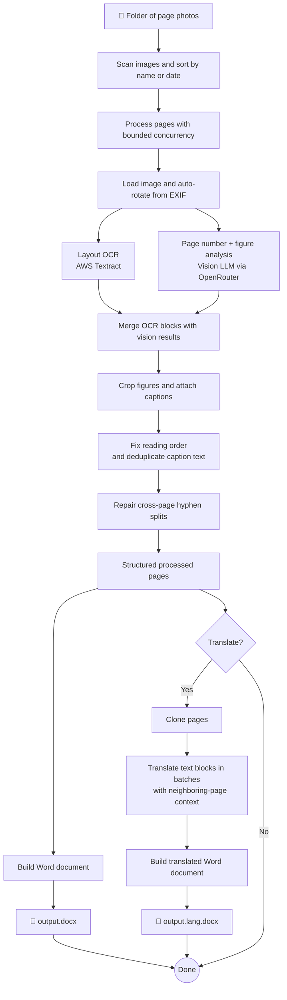

# Mermaid — Generate Mermaid Diagrams for the README

Generate clear, accurate Mermaid diagrams in the project README (or a specified Markdown file) to visualise architecture, data flows, class relationships, or other structures derived from the codebase.

Files and instructions: $ARGUMENTS

## Core principles

### Accuracy over aesthetics

- Every element in the diagram must reflect the actual codebase. Do not invent components, connections, or flows that do not exist
- Read the source files thoroughly before drawing anything. If a relationship is ambiguous, trace it in the code rather than guessing

### Clarity and readability

- Keep diagrams focused. A diagram that tries to show everything communicates nothing
- Use meaningful node labels derived from actual file, function, class, or module names in the codebase
- Prefer short, descriptive edge labels. Omit labels when the relationship is obvious from context
- Group related nodes with subgraphs when it improves readability, but do not over-nest

### Diagram type selection

Choose the Mermaid diagram type that best fits the subject:

- **flowchart** (`flowchart TD/LR`) — request flows, pipelines, decision trees, process steps
- **sequence diagram** (`sequenceDiagram`) — interactions between components over time (API calls, message passing)
- **class diagram** (`classDiagram`) — class hierarchies, interfaces, type relationships
- **entity-relationship** (`erDiagram`) — database schemas, data models, entity relationships
- **state diagram** (`stateDiagram-v2`) — lifecycle states, state machines, status transitions
- **architecture** (`architecture-beta`) — high-level system or infrastructure topology

If the user specifies a diagram type, use it. Otherwise, select the most appropriate one based on the code being visualised.

### Integration with the README

- Place the diagram in a logical section of the README. If a relevant section already exists, add the diagram there. If not, create a section with a clear heading
- Use a fenced Mermaid code block (` ```mermaid `) so the diagram renders natively on GitHub and other Markdown renderers
- If the README already contains a Mermaid diagram for the same subject, update it rather than adding a duplicate

## How to interpret arguments

The arguments are free-form and flexible. They may contain:

- File references of any type and in any format: `@service.ts`, `src/models/`, `handler.go, router.go`
- Natural language describing what to diagram, such as:
  - "the request flow through the API"
  - "the class hierarchy"
  - "how auth works end to end"
  - "the database schema"
- A target Markdown file: `put it in docs/architecture.md` (defaults to `README.md` if not specified)
- A preferred diagram type: `as a sequence diagram`, `use a flowchart`

Parse the arguments to identify which file(s) to read, what to visualise, where to place the diagram, and any additional instructions.

### Examples

- `/mermaid @service.ts @handler.ts the request flow` — diagram the request flow through these files
- `/mermaid src/models/ the entity relationships as an ER diagram` — generate an ER diagram from model files
- `/mermaid @auth.ts how authentication works end to end` — diagram the full auth flow
- `/mermaid @router.go @middleware.go as a sequence diagram` — visualise middleware and routing interactions
- `/mermaid src/ high-level architecture, put it in docs/architecture.md` — architecture overview in a specific file

## Style reference

Use the following diagram as a reference for style, tone, and formatting when generating flowcharts. Note how it uses emojis for input/output nodes, multi-line labels for steps that involve an external service or tool, decision nodes for branching logic, and a clean top-down layout:



Apply the same patterns to other diagram types where applicable (e.g. emojis for key entities, multi-line labels for steps with external dependencies).

## How to proceed

1. Read the specified file(s) to understand the code structure, components, and relationships
2. If no files are specified, use the natural language description to search the codebase for relevant files
3. Identify the key components, flows, or relationships to visualise based on the user's description
4. Select the most appropriate Mermaid diagram type (or use the one the user requested)
5. Generate the Mermaid diagram, ensuring every node and edge maps to something real in the codebase
6. Add the diagram to the target Markdown file (README.md by default) in a logical section with a clear heading
7. Review the diagram for accuracy, readability, and correct Mermaid syntax